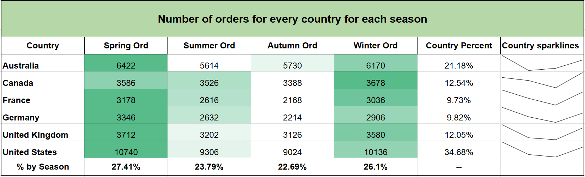

# 🚲 SQL Analysis of Bike Sales

## 📚 Table of Contents
- **Project Overview**
- **Data Overview**
- **Structure Explanation**
- **How to Run**
- **Sample Queries**
- **Technical Details**
- **Author**

## 🔎 Project Overview

<p style="text-align:justify;">
The goal of this project is to analyze bike sales across different countries. The project focuses on sales revenue in every country, customer age distribution and product performance. 

The project is centred around [SQL_Analysis_of_bike_sales.ipynb](SQL_Analysis_of_bike_sales.ipynb) file, which can be run using Google Colab, Jupyter Notebook or VS Code (with the required extensions). It includes everything you need — from importing the **SQLite** database to running SQL analysis scripts.

Either way, you can view the project here (*note: you can't make any changes to the code before downloading it to your own Google Drive*) ⟶ [GDrive](https://colab.research.google.com/drive/1-lBUfiiWdffZX2V6LjN0bZKobtMGEEUZ?usp=sharing)
</p>

## 📂 Data Overview

The dataset consists **one CSV file**:

- `Sales.csv` – contains order date, customer age, gender, country, product type, price etc.


**Data source:** [Kaggle Bike Sales Dataset](https://www.kaggle.com/datasets/sadiqshah/bike-sales-in-europe)


## 🧱 Structure Explanation

| Folder / File | Description |
|----------------|-------------|
| **Sales.csv** | Contains original data file |
| **SQL_Analysis_of_bike_sales.ipynb** | .ipynb file used for analysis |
| **Visualization/** | Excel file (downloaded from Google Sheets) used to visualize analysis |
| **README.md** | Project overview 

---

## ⚙️ How to Run

1. Download the entire folder
2. Install Jupyter Notebook, VS Code (with the required extensions) or upload the folder to your Google Drive
3. Run first cell in **SQL_Analysis_of_bike_sales.ipynb** file

In the **Google Colab** case, make sure to change this part of the code located in the first cell (if your path of the folder is different):

 `path = '/content/drive/MyDrive/Colab Notebooks/SQL Analysis of bike sales/Sales.csv'`


## 📈 Sample Queries

### Number of Orders - age distribution by gender:

``` sql
--1.1. Number of Orders (including quantity of each order) - age distribution by gender

WITH Age_Segmentation AS --Age segmentation
(
  SELECT
    Age,
    Gender,
    CASE
      WHEN Age < 18 THEN '1. UnderAge (below 18)' --in most countries mentioned in the data, the Age of majority is 18 (with some exceptions in certain parts of the USA and Canada)
      WHEN Age >= 18 AND Age < 25 THEN '2. Young Adults (18-24)'
      WHEN Age >= 25 AND Age < 35 THEN '3. Young Professionals (25-34)'
      WHEN Age >= 35 AND Age < 45 THEN '4. Early Adults (35-44)'
      WHEN Age >= 45 AND Age < 55 THEN '5. Middle Adults (45-54)'
      WHEN Age >= 55 AND Age < 65 THEN '6. Older Adults (55-64)'
      WHEN Age >= 65 THEN '7. Seniors'
    END AS Age_Group,
    Order_Quantity
  FROM
    Sales_Info
), Pre_Query AS
(
  SELECT --Age segmentation by gender
    Age_Group,
    SUM(Order_Quantity) AS Total_Sum_of_Orders,
    SUM(CASE WHEN Gender = 'F' THEN Order_Quantity END) Female_Orders,
    SUM(CASE WHEN Gender = 'M' THEN Order_Quantity END) Male_Orders
  FROM
    Age_Segmentation
  GROUP BY
    Age_Group
)
SELECT
  *,
  ROUND((SUM(Male_Orders + Female_Orders) OVER(PARTITION BY Age_Group)) * 100.0 / (SUM(Total_Sum_of_Orders) OVER()),2) || '%' AS Group_Percentage --age group / all groups ratio
FROM
  Pre_Query

UNION ALL

SELECT -- select with sums of total sum, female/male orders
  '--Total Sum--' AS Age_Group,
  SUM(Total_Sum_of_Orders),
  SUM(Female_Orders),
  SUM(Male_Orders),
  '--' AS Group_Percentage
FROM Pre_Query;
```

**Visualization:**


**Insights:**

<p style="text-align:justify;">
    Two major age groups take a clear lead in ordering the most bikes and other related products - Young Professionals (age between 25-34) and Early Adults (age between 35-44). Cycling is most popular among these 2 groups, likely because people around that age are reaching the peak of their careers (followed by financial stability), while still being young and physically active. 

In almost all groups men tend to order more than women. 
</p>

### Number of orders for every country for each season:

``` sql
--2.1 Number of orders for every country for each season

WITH Month_Extracted AS --extracting months
(
  SELECT
    Country,
    CAST(strftime('%m', Date) AS INTEGER) AS Month
  FROM
    Sales_Info
), Seasons AS --seasons case statement
(
  SELECT
    Country,
    CASE
      WHEN Month BETWEEN 6 AND 8 THEN 'Summer'
      WHEN Month BETWEEN 9 AND 11 THEN 'Autumn'
      WHEN Month = 12 OR Month BETWEEN 1 AND 2 THEN 'Winter'
      WHEN Month BETWEEN 3 AND 5 THEN 'Spring'
    END AS Season
  FROM
    Month_Extracted
), Pre_Query AS-- final query
(
  SELECT
    Country,
    COUNT(CASE WHEN Season = 'Spring' THEN 1 END) AS Spring_Ord,
    COUNT(CASE WHEN Season = 'Summer' THEN 1 END) AS Summer_Ord,
    COUNT(CASE WHEN Season = 'Autumn' THEN 1 END) AS Autumn_Ord,
    COUNT(CASE WHEN Season = 'Winter' THEN 1 END) AS Winter_Ord
  FROM
    Seasons
  GROUP BY
    Country
)
SELECT
  *,
  ROUND(SUM(Spring_Ord + Summer_Ord + Autumn_Ord + Winter_Ord) OVER(PARTITION BY Country)*100.0 / SUM(Spring_Ord + Summer_Ord + Autumn_Ord + Winter_Ord) OVER(),2) || '%' Country_Percent
FROM
  Pre_Query

UNION ALL

SELECT DISTINCT --every season by all seasons ratio
  'Percent_by_Season',
   ROUND(SUM(Spring_Ord) OVER()*100.0 / SUM(Spring_Ord + Summer_Ord + Autumn_Ord + Winter_Ord) OVER(),2) || '%',
   ROUND(SUM(Summer_Ord) OVER()*100.0 / SUM(Spring_Ord + Summer_Ord + Autumn_Ord + Winter_Ord) OVER(),2) || '%',
   ROUND(SUM(Autumn_Ord) OVER()*100.0 / SUM(Spring_Ord + Summer_Ord + Autumn_Ord + Winter_Ord) OVER(),2) || '%',
   ROUND(SUM(Winter_Ord) OVER()*100.0 / SUM(Spring_Ord + Summer_Ord + Autumn_Ord + Winter_Ord) OVER(),2) || '%',
   '--'
  FROM
    Pre_Query
```

**Visualization:**



**Insights:**

<p style="text-align:justify;">

All six countries show a similar order distribution across the seasons. Most sales occur in spring and winter, while the least take place in summer and autumn. The majority of sales were made in the USA (34.68%), then in Australia (21.18%). Canada and the UK have almost the same percantage of total orderds 
(around 12%), as do France and Germany (around 10%).
</p>


## 🖥️ Technical Details

- **Database:** SQLite
- **Environment:** Google Colab
- **Visualization:** Google Sheets
- **Data source:** [Kaggle Bike Sales Dataset](https://www.kaggle.com/datasets/sadiqshah/bike-sales-in-europe)


## ✒️ Author

- **Author:** Mateusz Bochenek
- **Mail:** matbochenek42@gmail.com
- **GitHub link:** https://github.com/matbochenek42
- **LeetCode link:** https://leetcode.com/u/SmO7BWmsiz/