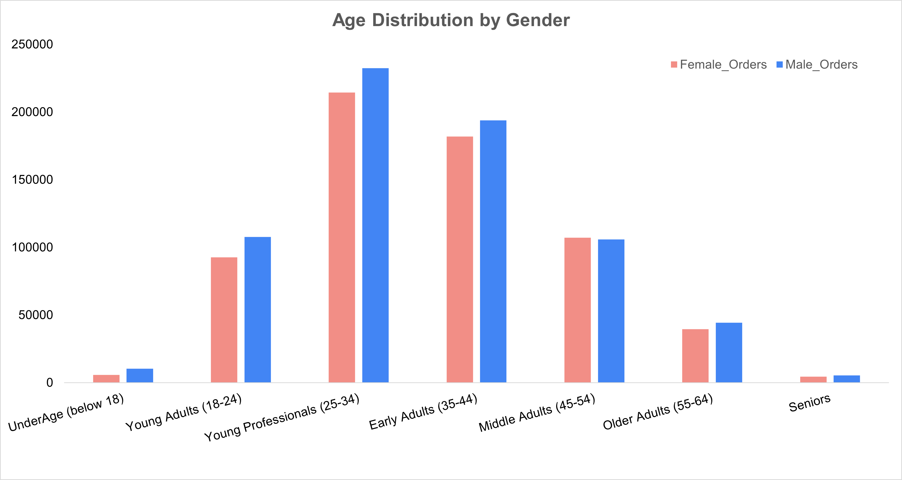
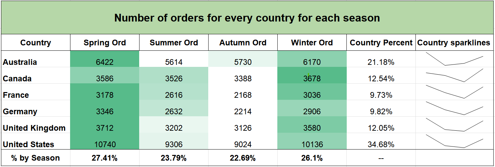

# 🚲 SQL Analysis of Bike Sales

## 📚 Table of Contents
- **Project Overview**
- **Data Overview**
- **Structure Explanation**
- **How to Run**
- **Sample Queries**
- **Technical Details**
- **Author**

## 🔎 Project Overview

The goal of this project is to analyze bike sales across different countries using T-SQL. The project focuses on sales revenue in every country, customer age distribution and product performance.

## 📂 Data Overview

The dataset consists **one CSV file**:

- `Sales.csv` – contains order date, customer age, gender, country, product type, price etc.

**Data source:** [Kaggle Bike Sales Dataset](https://www.kaggle.com/datasets/sadiqshah/bike-sales-in-europe)

## 🧱 Structure Explanation

| Folder / File | Description |
|----------------|-------------|
| **sql_files** | SQL files used for analysis |
| **visualization/** | Charts |
| **README.md** | Project overview |
| **Sales.csv** | Original data file |

---

## ⚙️ How to Run

1. Install T-SQL locally 
2. Download the entire folder
3. Run SQL scripts starting with the [1_Create_DB.sql](sql_queries/1_Create_DB.sql) file (*update directory path*)

## 📈 Sample Queries

### Number of Orders - age distribution by gender

**Query:** [2_Number_of_Orders.sql](sql_queries/2_Number_of_Orders.sql)

**Visualization:**

**Insights:**

Two major age groups take a clear lead in ordering the most bikes and other related products - Young Professionals (age between 25-34) and Early Adults (age between 35-44). Cycling is most popular among these 2 groups, likely because people around that age are reaching the peak of their careers (followed by financial stability), while still being young and physically active.

In almost all groups men tend to order more than women.

### Number of orders for every country for each season

**Query:** [3_Countries_Breakdown.sql](sql_queries/3_Countries_Breakdown.sql)

**Visualization:**

**Insights:**

All six countries show a similar order distribution across the seasons. Most sales occur in spring and winter, while the least take place in summer and autumn. The majority of sales were made in the USA (34.68%), then in Australia (21.18%). Canada and the UK have almost the same percantage of total orderds
(around 12%), as do France and Germany (around 10%).

## 🖥️ Technical Details

- **DBMS:** T-SQL
- **Environment:** SQL Server Management Studio 22
- **Visualization:** Excel
- **Data source:** [Kaggle Bike Sales Dataset](https://www.kaggle.com/datasets/sadiqshah/bike-sales-in-europe)

## ✒️ Author

- **Author:** Mateusz Bochenek
- **Mail:** matbochenek42@gmail.com
- **GitHub link:** https://github.com/matbochenek42
- **LeetCode link:** https://leetcode.com/u/SmO7BWmsiz/